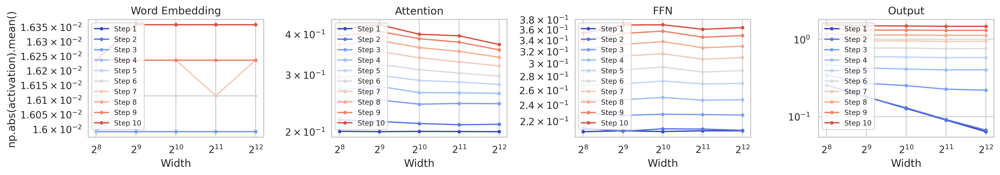
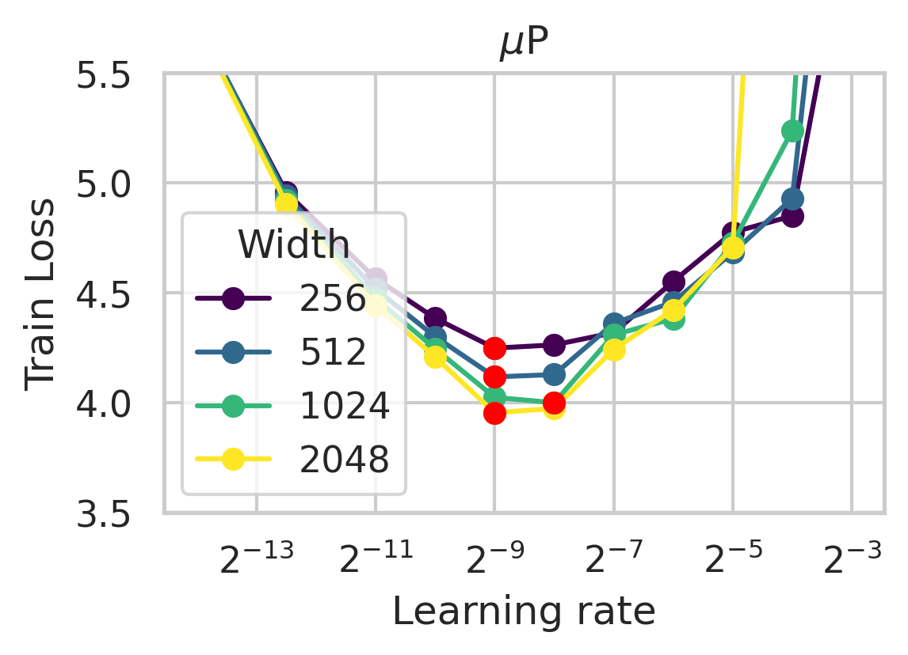

# Maester

A high-performance distributed training framework for large language models, built on top of PyTorch and heavily inspired by `torchtitan`.

## Features

- **μP (muP) Implementation**: Principled parameter scaling that allows training hyperparameters to transfer between different model sizes
- **Distributed Training**: Efficient multi-GPU and multi-node training capabilities
- **Custom Job Management**: Advanced job scheduling and management system
- **Experimental Dataloader**: Modified version of IBM's dataloader contribution with on-the-fly tokenization
- **SLURM Integration**: Optimized for supercomputer environments (LUMI)

## Installation

```bash
# Clone the repository
git clone https://github.com/rlrs/maester.git
cd maester

# Install dependencies
uv sync
```

## Requirements

- Python >= 3.10
- PyTorch >= 2.5, ideally nightly
- The framework is set up for training on the LUMI supercomputer, which uses SLURM and AMD GPUs. Most features are not specific to this setup, though.

## Usage

### Framework Overview

#### Configuration System

The framework uses a Pydantic-based configuration system that allows for:
- Configuration via JSON files, environment variables, and command-line arguments
- Strict type checking and validation
- Nested configurations for model, training, and infrastructure settings

#### Job Management

The framework uses a structured approach to job management, centered around self-contained job directories and Pydantic-based configuration:

#### Configuration System
- Base configuration defined in `maester/config.py` using Pydantic
- Configurations can be provided via YAML files, environment variables, or command-line arguments
- All job-specific configurations are automatically serialized to JSON in the job directory

#### Job Directory Structure
Each job gets its own directory under `jobs/` containing:
- `config.json`: Complete configuration snapshot for reproducibility
- `slurm.sh`: Generated SLURM script from template
- `logs/`: Directory for SLURM output and error logs
- `checkpoints/`: Training checkpoints and model states

#### Job Submission Tools

##### submit.py
- Takes a Pydantic configuration from `maester/config.py`
- Creates a job directory with all necessary files
- Generates a SLURM script from `templates/slurm.sh`
- Jobs can be resubmitted directly with `sbatch jobs/name/slurm.sh`

##### sweep.py
- Extends the base configuration system from `maester/config.py`
- Allows parameter modifications through `sweep_config.py`
- Creates separate job directories for each parameter combination
- Provides tools for:
  - Sweep submission and monitoring
  - Result analysis and visualization
  - Job management (cancel, retry, etc.)

#### SLURM Integration
- Template-based SLURM script generation (`templates/slurm.sh`)
- Container-specific setup in `scripts/slurm/`
- Automatic handling of:
  - Resource allocation
  - Environment setup
  - Log management
  - Container binding and configuration

#### Example Usage

1. Submit a single job:
   ```bash
   # Submit with config file
   python submit.py config.yaml
   
   # Resubmit existing job
   sbatch jobs/my_job/slurm.sh
   ```

2. Run a parameter sweep:
   ```bash
   # Define sweep parameters in sweep_config.py
   python sweep.py submit sweep_config.py
   
   # Monitor sweep status
   python sweep.py status sweeps/my_sweep
   ```

### Running Training Jobs

#### On SLURM Systems (Recommended)
Use the job submission system:
```bash
# Submit a single training job
python submit.py config.yaml

# Or run a parameter sweep
python sweep.py submit sweep_config.py
```

#### Direct Execution
For development or non-SLURM environments, you can run the training script directly:
```bash
torchrun --nproc_per_node=8 train.py
```

### Converting and Uploading Checkpoints

Convert and upload checkpoints to Hugging Face:
```bash
python scripts/convert_dcp_to_hf.py \
    jobs/mistral-7b/checkpoints/ \
    ../output-dir/hf/ \
    --upload org-name/model-name \
    --name step-400 \
    --base base-model-name
```

## μP (muP) Validation

The framework implements μP (muP) parametrization for principled hyperparameter transfer between models of different scales. Here are two validation experiments:

### Coordinate Check

A basic validation of the μP implementation showing expected behavior across different model scales.

### Learning Rate Transfer


Demonstration of successful learning rate transfer between models of different sizes, a key benefit of μP parametrization.

The plots themselves can be reproduced using the scripts in the `plots/` directory.

## Project Structure

- `maester/`: Core library code
  - `datasets/`: Dataset implementations including experimental dataloader
  - `parallelisms/`: Distributed training implementations
- `scripts/`: Utility scripts for training, conversion, etc.
- `jobs/`: Job management and configuration
- `tests/`: Test suite (WIP)

## Credits

This project builds upon several open-source projects:

- [pytorch/torchtitan](https://github.com/pytorch/torchtitan): Many core features are based on `torchtitan`.
- [IBM's experimental dataloader](https://github.com/pytorch/torchtitan/pull/376): Distributed dataloader contribution. This framework uses a modified, on-the-fly tokenization pipeline that reads raw texts from Parquet files.
- [μP (muP)](https://github.com/microsoft/mup): Implementation inspired by Microsoft's muP framework for principled hyperparameter transfer.

## License

See the [LICENSE](LICENSE) file for details.

## Contributing

Contributions are welcome! Please feel free to submit a Pull Request.
